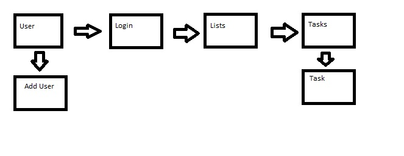
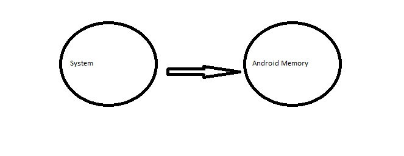
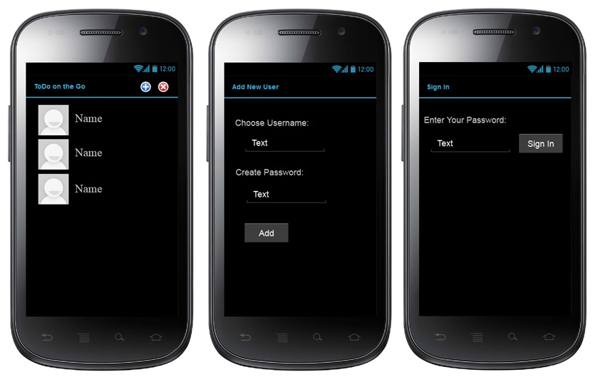
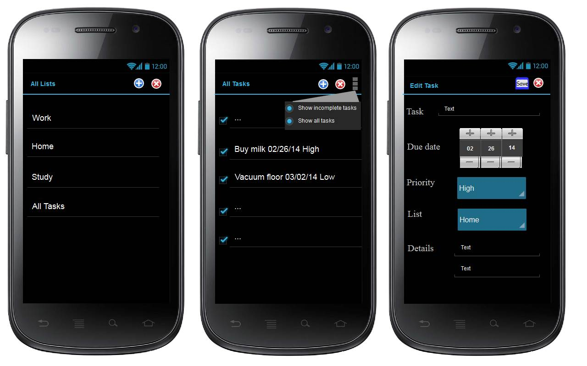

# Design Document – Team X
## 1 Introduction
This product, named TODO On the Go, is an android application that will provide an interactive to do list supporting multiple users.

## 2 Design Considerations

### 2.1 Assumptions
The assumption is that this application will run on a standard Android device complete with Android libraries and operating system. The application will only run on an Android device or emulator. 

### 2.2 Constraints
The main constraint on the system is the memory and storage capacity of an Android device, these constraints must be considered when producing the application.

### 2.3 System Environment
The system must operate on an Android device and in the Android operating system.

## 3 Architectural Design

### 3.1 Overview
<ol>
<li>Startup Screen-This screen will display the Users and corresponding names and have the buttons and methods to add or delete users and activating a user will lead to a login screen before continuing.</li>
<li>Add User- This section will consist of a screen to add new users with username and password and the methods to support this.</li>
<li>Login- This section will consist of a screen where the user can login with their password and will contain the methods to authorize a user.</li>
<li>Lists Screen- This section will a screen with the different categories of Lists available and the options to add and delete categories. The categories will lead into the Task list.</li>
<li>Tasks - This section will contain a UI screen with the tasks listed and options to add and delete tasks, check completed tasks, and show checked or all tasks. This section will include the methods to support these options.</li>
<li>Individual Task- This section contains a UI screen with a Task Name, Due date, Priority, and Details and the methods to support this functionality. The tasks should also be saved in this section.
</ol>

### 3.2 Rationale
Since the system is being developed as an Android application it is easy to divide the system up among Activities and intents and makes for an easy implementation of the sections.

### 3.3 Conceptual (or Logical) View
The user either selects the add user screen or selects a user and goes to the login screen. After the user logins it goes to the lists screen where they can choose the list. This list then lists to the task list and the tasks can be added on the Task screen.

## 4 Low Level Design

### 4.1 Class Diagram

In the case of an OO design, the internal structure of a software component would typically be expressed as a UML class diagram that represents the static class structure for the component and their relationships (association, aggregation, generalization, etc.)

### 4.2 Sequence Diagram

### 4.3 Component Diagram
The application interfaces with the Android storage memory to store the login information and all the users, lists, and tasks.

## 5 User Interface Design

