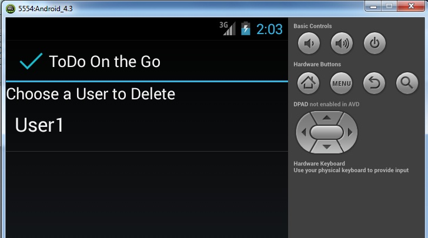

# User Documentation
## 1 Introduction
This product, named TODO On the Go, is an android application that will provide an interactive to do list supporting multiple users.

## 2 User Guide Table of Contents
<ol>
<li>Introduction </li>
<li>Table of Contents </li>
<li>Navigation </li>
<li>Adding a User </li>
<li>Deleting a User</li>
<li>Login to User</li>
<li>Add a list</li>
<li>Select a list</li>
<li>Delete a list</li>
<li>Add a new task task</li>
<li>Edit/Delete a task</li>
<li>View All or Incomplete Tasks</li>
</ol>

## 3 Navigation
In general, to proceed forward in the application, tap on a list item or button. To return to a previous screen, press the back button on your Android device.

## 4 Adding a User
<li>To add a user tap the "Add a New User" button on the interface. </li>

<li>Then type in the user name and password in the designated places and hit "Add User" </li>

## 5 Delete User
On the Home screen hit the "Delete a User" button.

On the Delete User Screen select the User you wish to Delete. Then hit "yes" to confirm or "no" to cancel.

## 6 Logging in as a User

On the Home screen tap on a user name from the list.

On the Log In screen type in the password and hit the "Login" button. If the password is incorrect you will get a message and will not be able to continue until the correct password is given.

## 7 Adding a List

The application has functionality for different lists for one user that can be categorized as the user sees fit. The user can click "View All Tasks" to skip this functionality. In order to start a list tap the "Add a New List" button.

Now type in the name of the list and hit the "Save" button.

## 8 Select a List

Either select "View All Tasks" or tap on the name of a list to go to the list of tasks.

## 9 Delete a List

After you have selected a list you can delete it by tapping the "Delete This List" button.

## 10 Add a New Task

Tap "Add a New Task" on the Tasks Screen.

Fill in the appropriate fields for the Tasks including: Name, Due Date, Priority, Completion Status, List Name, and any Details desired and hit "Save". You can also hit "Clear" to clear all fields or hit "Cancel" if you do not wish to add a new task.

## 11 Edit/Delete a Task

From the Tasks Screen tap on a task to see that task's details. From here you have the options to Edit or Delete the Task.

To Edit the Task select "Edit This Task" from the details screen.

This will take you back to the task screen just like adding a new task. Here you can update the properties of the task as desired.

To delete a task select the "Delete This Task" button. This will give you a Yes or No confirmation and will remove the task if you select "Yes".

## 12 View All or Incomplete Tasks

The user can choose to mark a task as complete by placing a check mark in the box next to the Task. This allows the user to display only incomplete tasks or all tasks. On the screen with the tasks shown below choose the "Incomplete" button to show only those tasks without a completed check mark or choose "All" to show completed and incomplete tasks.

